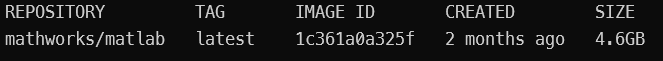
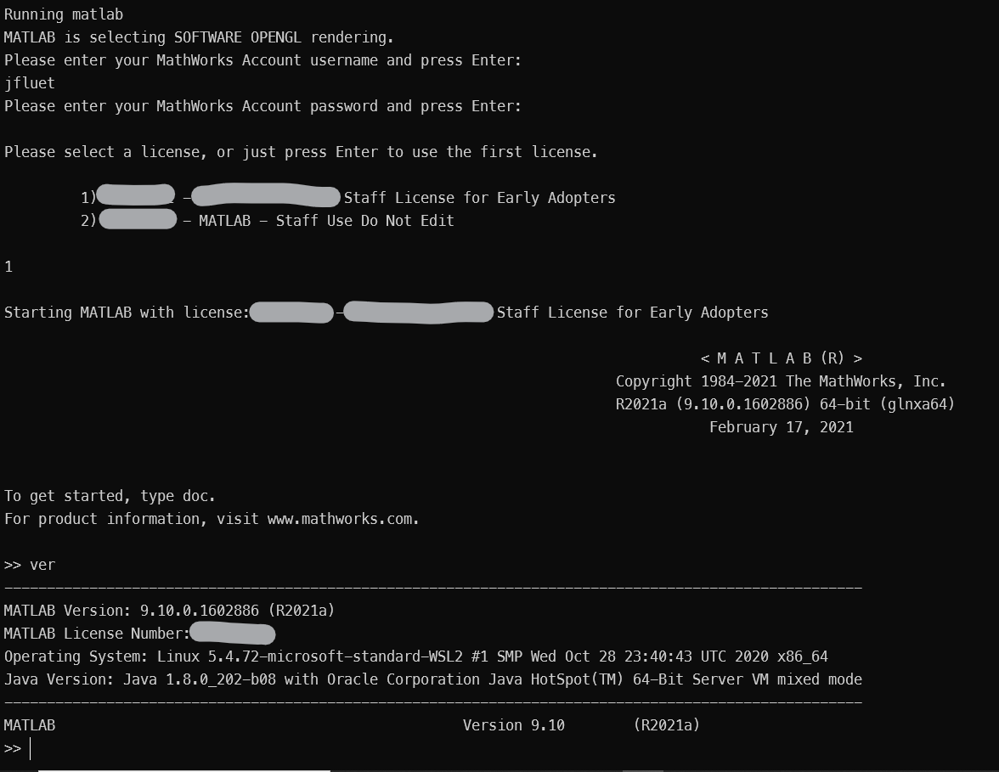
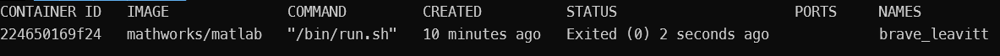
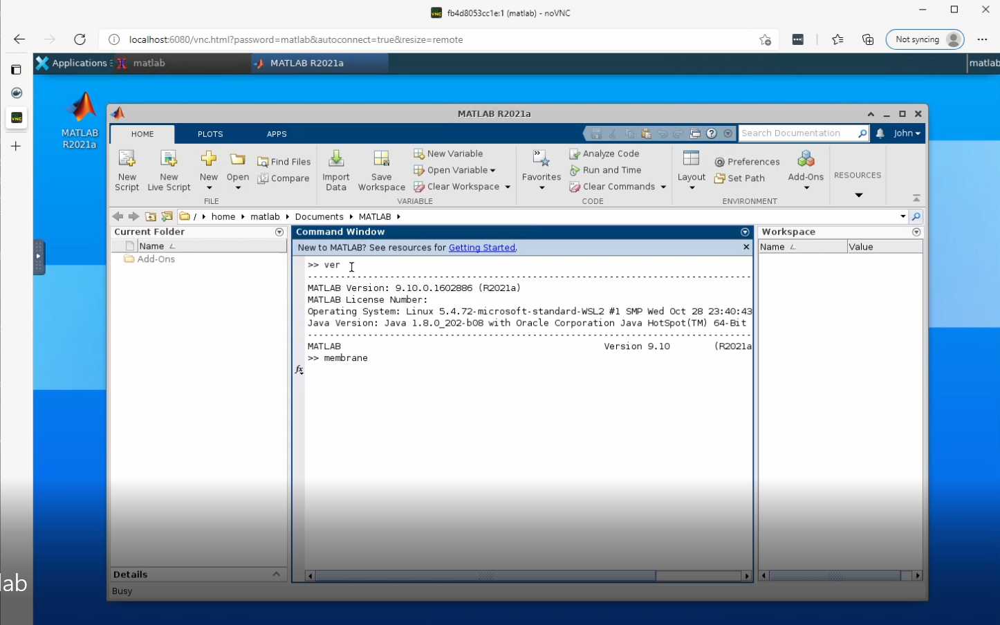
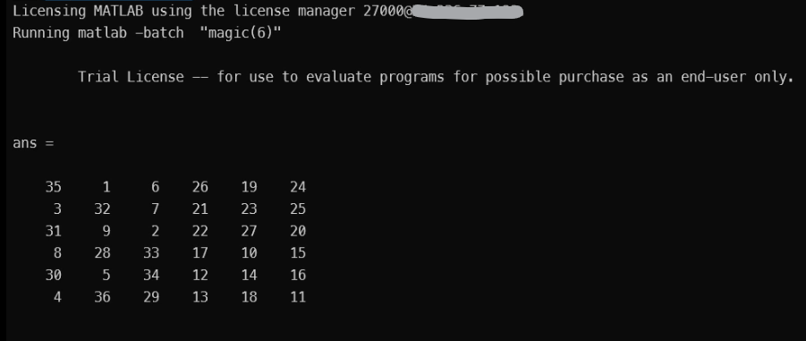
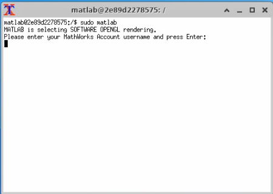
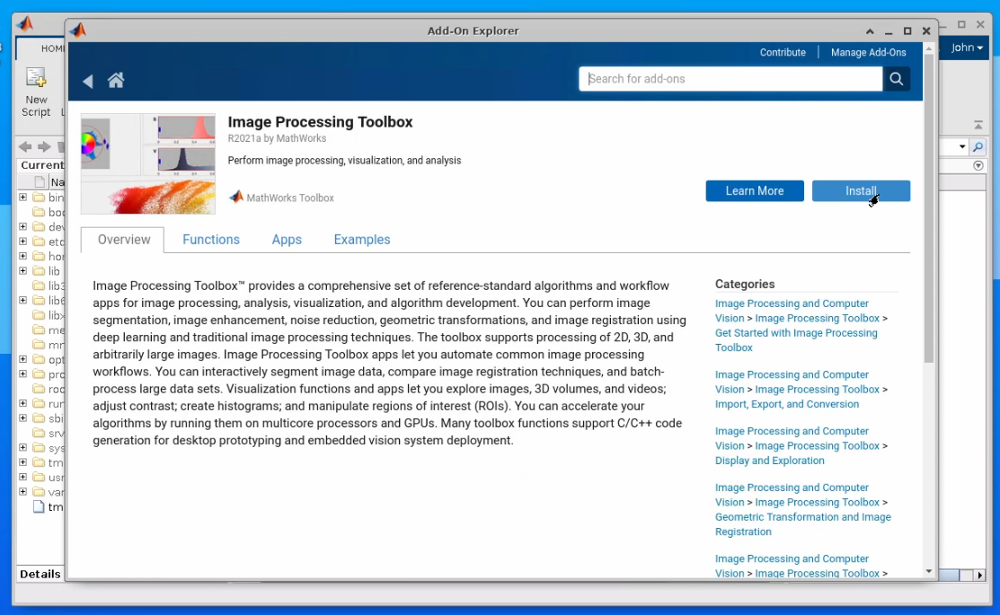
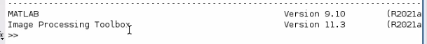
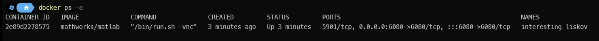
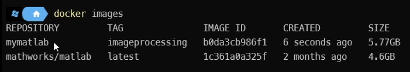

# Getting Started with MATLAB&reg; in Docker

Running MATLAB&reg; inside a docker container can be challenging if you're building it on your own. Fortunately, we've done most of the work for you.  This set of tutorials will walk you through the steps to downloading, running and even building your own MATLAB containers. 

## Docker Components

There are two primary components to docker, the Docker Engine and Docker Client.   The Engine is a background process that manages the containers. The client is the command line tool used to build and run containers.  Once installed you don't generally need to worry about the engine.  You'll interact with docker using the client.

## Install Docker

To follow these tutorials you'll need docker installed on your machine.  Head over to docker.com to [download and install](https://www.docker.com/products/docker-desktop) docker for your platform (Windows, Mac or Linux).  Once you're set up join me below to learn how to run MATLAB in containers.

## Lessons
[Running: Starting a MATLAB Container](#running-matlab-in-a-container)

[Running: The MATLAB Desktop](#running-matlab-desktop-in-a-container)

[Running: Batch Mode](#running-matlab-in-batch-mode)

[Running: Accessing files](#accessing-files)

[Customizing: Taking Snapshots](#customizing-making-snapshots)

[Customizing: Build your own MATLAB docker image](#customizing-build-your-own-image)

[Customizing: Building from Scratch](#customizing-build-from-scratch)


# Working with containers

## Running MATLAB in a container

In this tutorial, you'll learn how to use the docker client to pull and run containers from existing images, view the images and containers on your machine, and delete images and containers.

We'll get started by using the basic MATLAB docker image published by MathWorks.  This container includes everything you need to run MATLAB and is a good starting point.

To run a container we'll first need to locate one.  The primary place to find container images is [DockerHub](https://hub.docker.com), a centralized docker container image registry. There you'll find thousands of containers for all sorts of uses.  A registry is where images are stored and distributed.  Images are stored in individual repositories which hold all the versions of an image.  Since we're interested in MATLAB we can find it at https://hub.docker.com/r/mathworks/matlab.

### Pull a container
To download the image we tell docker which one we want.  By default this will try to find the image on DockerHub.  

To pull the latest matlab image we use the pull command.

```bash
docker pull mathworks/matlab
```
Docker will contact the registry and download the requested image.  We've just pulled the latest image but it is possible to pull a specific version by using a tag.  For instance, we could have run ```docker pull matlab:r2021a```

This will take some time depending on your bandwidth since the image is pretty big.  Once the download completes we can view the image.

```bash
docker images
```
This will list the images on this machine


Now that we have the image we'll start a container from it using the run command.  
### Run a container
```bash
docker run -it mathworks/matlab
```

This will launch MATLAB.  The ```-it``` switch indicates we want an interactive terminal.  We use this so the container doesn't exit right away.

#### Licensing check
By default this container is configured to use Online Licensing so if you have an individual license or your organization is setup to use Online Licensing enter your MathWorks Account username and password. If you cannot use Online Licensing see [license server instructions](#license-server) below.



Running the ver command lists MATLAB as the one product installed in the container. 

Type ```exit``` and press RETURN.  This will exit the container. 

Docker's process status command (ps) will show us the containers on our system.

```bash
docker ps -a
```
Passing the -a flag tells docker to show all containers on this machine regardless of status.  Here we can see the one container we ran with the status of Exited.



The container still exists.  We could relaunch it or snapshot it at this point.  However, it's just taking up disk space so lets delete it.

```bash
docker rm 224650169f24
```

The container may be gone but the image persists.  Run ```docker images``` again and you should see the image is still where we left it.  


### License Server

Online Licensing isn't always an option and in some cases isn't a desired workflow (e.g. batch).  Fortunately, we can tell MATLAB to use our license server instead.  Here's how we do that when running the container.

```docker
docker run -it --rm -e MLM_LICENSE_FILE=27000@12.123.12.123 mathworks/matlab
```

You can specify the license server you want the container to acquire licenses from by passing an environment variable with the -e option when you launch a container.  This will set up an environment variable within the container.  MATLAB conveniently looks for MLM_LICENSE_FILE when starting and will use it for the licensing.  You'll need to replace my obviously fake IP address (12.123.12.123) with your own server's address.  Your admin should be able to help you out if you don't have know what it is.

We're off to a good start but MATLAB is much more interesting if you can access the Desktop.  Let's see how we do that next.

## Running MATLAB Desktop in a container

The mathworks/matlab image provides a convient option to run in [VNC](http://www.remoteaccess.org/what-is-a-vnc/) mode.  This will let you connect using either a browser or a VNC client to access the desktop.  We can access those with docker run command.

### Launching with VNC mode
```bash
docker run -it --rm -p 5901:5901 -p 6080:6080 mathworks/matlab -vnc
```

There's a whole lot going on in the line so let's break it down.

 `--rm` tells docker to remove the container when it stops. 
  
 `-p` opens a port.  Containers run in an isolated environment so we need to tell docker which ports to allow into the container.  The first number is the port on the host machine (your machine if running locally) and the second is the port inside the container.  when we navigate to a port on the localhost it is redirected to the container's port.  The first port 5901 is the standard VNC port which you can see in action below.  The second port is for web access to the VNC session.  We'll see that in just a moment.

 `-vnc` This isn't a docker option.  It's an option sent to the matlab image when it starts up.  There are several switches.  Run ```docker run mathworks/matlab -help``` to see all the options

### Connecting to the desktop in a browser
Open a web browser and navigate to ```localhost:6080```.  You should see a desktop in your browser.  Double-click the MATLAB icon on the desktop and you'll be prompted to sign in as before.  Enter your MathWorks Account credentials, select a license if necessary and now you can use the MATLAB desktop.  



### Using a VNC client
That other port mapping we provided is the standard VNC port (5901).  If you have a VNC client on your machine you can open that and enter ```localhost:1``` when prompted and enter the password.  By default that is *matlab*.  You can change the password used when you launch the container if you prefer.

Once you connect you'll see the same window as you saw in the browser.  If you have them both open at the same time you'll notice they are views into the same desktop session.

You may see a warning when running the container to provide it more memory.  For our tutorial it isn't a big deal but you'll need to specify more memory for the container when it runs.  Use the --shm-size command to increase it when launching the container.

```bash
docker run -it --rm -p 5901:5901 -p 6080:6080 --shm-size=512M  mathworks/matlab -vnc
```

If you're running on Linux there is a more direct way to access the desktop using X11.  See https://hub.docker.com/r/mathworks/matlab for details.

The desktop is great for design work but containers are very useful for background tasks and as part of continuous integration (CI/CD) workflows.  For those workflows batch mode is more convenient.

## Running MATLAB in Batch Mode

To launch a MATLAB container in batch mode we simply pass the -batch switch to the image.  This is a special switch for the container so make sure it follows the image name.  We then put the code we want to run as part of the batch operation in quotes.  Here is how we can run the magic command in batch mode.

```bash
docker run -it --rm mathworks/matlab -batch "magic(6)"
```
If you run this you'll notice an error immediately.  


Batch mode requires a license server to run.  We can fix that by providing the environment variable MLM_LICENSE_FILE with the -e option when you launch a container.  This will set up an environment variable within the container.  MATLAB conveniently looks for MLM_LICENSE_FILE when starting and will use it for the licensing.  You'll need to replace my obviously fake IP address (12.123.12.123) with your own server's address.  Your admin should be able to help you out if you don't have know what it is.

```bash
docker run -it --rm -MLM_LICENSE_FILE=27000@12.123.12.123 mathworks/matlab -batch "magic(6)"
```
The container will launch and if there are no errors the container will exit.



We can check to see if there are any containers still around.

```bash
docker ps -a
```


As you can see they have been cleaned up including the one that produced an error earlier.

Batch commands are easy to run but specifying the code for every run would be tedious and limited. A better option is to load a file that contains the code we want to run.  Guess what we're going to do next?

<a name="files"></a>
## Accessing files

To use files with a container we need to mount a volume.  In this tutorial we'll mount a directory so the our container can run a file from it.  

First we need a script to run.  Create a file in the current directory called "myscript.m".  We'll use this file as a batch command run by matlab.  

```dos
"magic(6)" > myscript.m
```

Next we need to mount the volume.  We do that using the -v option.  This lets us specify which directory from our host machine should be mounted in the container.  In the example below we specify the current working directory using the special string "${PWD}".  This prints the current directory path same as <code>pwd</code> on the command line.  The path after the colon is where this directory is mapped within the container.  In this case a directory called /mnt/scripts.

Run the following to list the contents of the mounted directory.

```bash
docker run -it --rm -MLM_LICENSE_FILE=27000@12.123.12.123 -v "${PWD}:/mnt/scripts" mathworks/matlab -batch "ls /mnt/scripts"
```

This should match the directory listing on the local host since they are pointing at the same directory.

We can run the script by passing it to the run command.  Note how we use the full path to find the script to run.

```bash
docker run -it --rm -MLM_LICENSE_FILE=27000@12.123.12.123 -v "${PWD}:/mnt/scripts" mathworks/matlab -batch "run('/mnt/scripts/myscript.m')"
```

<a name="snapshots"></a>
## Customizing: Making snapshots

MATLAB is great and all but it's even better with some toolboxes.  In this tutorial we'll add the Image Processing Toolbox&trade; (or pick one of your favorites) to our container and snapshot an image from that.  We will then launch a new container based on our new customized image.

Launch a MATLAB Container in vnc mode so we can access the desktop client.

```bash
docker run -it --rm -p 6080:6080 mathworks/matlab -vnc
```

Connect to the session using ```https://localhost:6080``` and open a MATE terminal. Click on the icon in the lower left of the desktop's task bar and select "System Tools>MATE Terminal".  We need to run MATLAB in admin mode in order to modify the installation.  To do that we run MATLAB as sudo mode.

```bash
sudo matlab
```

 

Once in MATLAB click Add-Ons, search for Image Processing, click its link and then click "Install".  This will launch the installer.  



Once the download and installation completes MATLAB will relaunch.  You can type 'ver" and verify that Image Processing Toolbox has been installed.



Close out of MATLAB (not the VNC session) so we can capture this image.  It's important to leave the container running at this point. This is due to the "--rm" flag we used when launching the container.  Had I thought ahead I might have omitted that and stopped/removed the container later.  That might be something you want to try on your own.

For now, open a new command window and check that the container is running

```docker
docker ps -a
```


Here we can see we have the one container running.  Use docker commit to create a snapshot.  We pass the name of the container (ID works as well) and provide a new image and tag name.  Say Cheese!  

```docker
docker commit intesting_liskov mymatlab:imageprocessing
```



We now have our own image that contains both MATLAB and Image Processing.
Let's launch a new container based on our new image.

```docker
docker run -it --rm -p 6080:6080 mymatlab:imageprocessing -vnc
```
Run ver again and you'll see that image processing is already installed in this image. 

<a name="build"></a>
## Customizing: Build your own image

Let's learn how we can build our own image using a Dockerfile.  A Dockerfile is used to define all the commands that when run, make up the image.  In this tutorial, we'll write our own Dockerfile to include a script file in the image to run when the container launches.

Create a new document called "Dockerfile".  Ensure you don't end up with an extension if you're using an editor like notepad.  Copy and paste the following into the file and save.  

```Dockerfile
# Build from MATLAB base image
FROM mathworks/matlab:latest

# Copy your script into the image
COPY myscript.m ./

# Start MATLAB in batch mode to execute script
CMD ["matlab", "-batch", "myscript"]
```

FROM specifies the starting point for the image we are building. In this case, we've specified the image mathworks/matlab:latest as our base image.  The rest of the commands will be applied based on that image.   

COPY simply copies the specified file from our host computer into the image's working folder.

CMD is a list of the commands that make up the command that is executed when the image is run.  In this case, matlab -batch "myscript" is what will run when launched.

Make sure to save the file and we can issue the docker build command.  As part of building we can use -t to "tag" the image.  

```docker
docker build -t matlab:withscript .
```

List the images we now have locally.

```docker
docker images
```
Executing docker build has resulted in a new image named "matlab" with a tag of "withscript".  
We need to specify both the name and tag to launch a container from this image.

```docker
docker run -it --rm matlab:withscript
```

The batch command runs.  Note that we can run this image anywhere.  We copied that script into the image when it was built and is now part of the image.

Remove the image when you're done with it.

```docker
docker rmi matlab:withscript
```
<a name="build"></a>
## Customizing: Build from scratch

You can have full control over the selection of products or the operating system then you'll want to build your own using a Dockerfile.  A great place to start is this [MATLAB Dockerfile reference](https://github.com/mathworks-ref-arch/matlab-dockerfile) that includes a lot of the configuration you may need for your own container.  It is based on the [mathworks/matlab-deps container image](https://hub.docker.com/r/mathworks/matlab-deps), an image that includes all the common dependencies required by MATLAB and related products.  If you would like a different OS than Ubuntu then you'll need to build those dependencies from scratch. 

## Resources
- MATLAB docker image
https://hub.docker.com/r/mathworks/matlab
- MATLAB-Deps container image 
https://hub.docker.com/r/mathworks/matlab-deps
- MathWorks Dockerfile for DIY on GitHub
https://github.com/mathworks-ref-arch/matlab-dockerfile
- MATLAB Deep Learning Image on Nvidia GPU Cloud
https://ngc.nvidia.com/catalog/containers/partners:matlab
